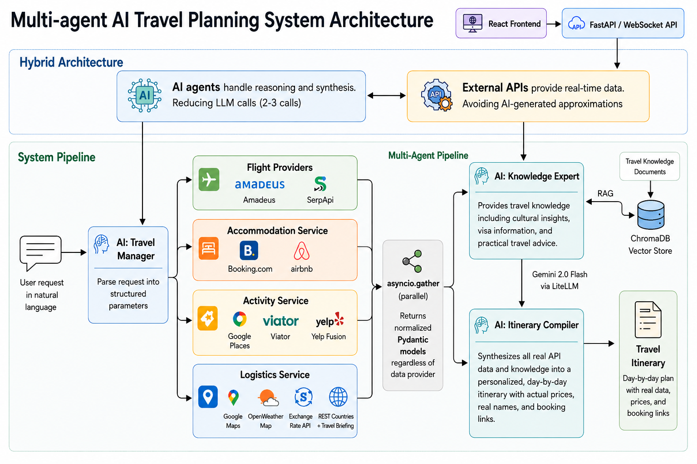

# Multi-Agent AI Travel Planner

An AI-powered travel planning platform that combines multi-agent orchestration, real-time travel APIs, and Retrieval-Augmented Generation (RAG) to create personalized travel itineraries based on live travel data.

Unlike traditional AI travel assistants, this system separates reasoning from data retrieval. AI agents handle planning and decision-making while external APIs provide factual travel information such as flights, accommodations, activities, weather, and logistics.

---

## Architecture



The platform follows a hybrid architecture:

* AI agents perform reasoning and itinerary generation
* External APIs provide real-time travel data
* ChromaDB-powered RAG supplies cultural and practical travel knowledge
* Async services retrieve information in parallel for improved performance

---

## Key Features

### Multi-Agent Workflow

* Travel Manager
* Knowledge Expert
* Itinerary Compiler

### Real-Time Travel Data

#### Flights

* Amadeus
* SerpApi

#### Accommodation

* Booking.com
* Airbnb

#### Activities

* Google Places
* Viator
* Yelp Fusion

#### Logistics

* Google Maps
* OpenWeatherMap
* Exchange Rate API
* REST Countries API

### Knowledge Layer

* ChromaDB
* Travel Knowledge Documents
* Retrieval-Augmented Generation (RAG)

---

## Technology Stack

### AI

* CrewAI
* Google Gemini
* LiteLLM

### Backend

* FastAPI
* WebSockets
* HTTPX
* AsyncIO

### Knowledge & Retrieval

* ChromaDB
* LangChain

### Frontend

* React
* Vite

---

## Example Request

Plan a 5-day trip to Paris for a solo traveler who loves art and food with a budget of $200 per night.

---

## Example Output

* Flight recommendations
* Hotel suggestions
* Restaurant recommendations
* Attractions and tours
* Weather forecast
* Transportation guidance
* Budget breakdown
* Personalized day-by-day itinerary

---

## Quick Start

```bash
git clone https://github.com/afroozmohandesian/ai-travel-planner.git

cd ai-travel-planner

python -m venv venv
source venv/bin/activate

pip install -r requirements.txt
```

Run backend:

```bash
uvicorn backend.app:app --reload
```

Run frontend:

```bash
cd frontend

npm install
npm run dev
```

For complete setup instructions see SETUP.md.

---

## License

MIT License

---

## Author

Afrooz Mohandesian

AI Engineer | Generative AI | Machine Learning | Multi-Agent Systems
